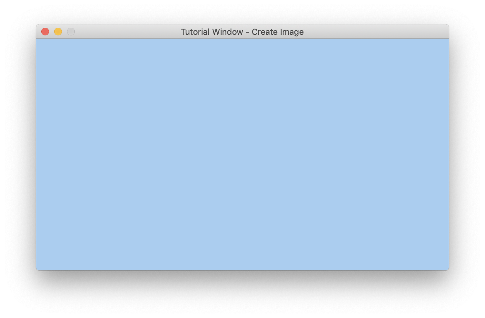
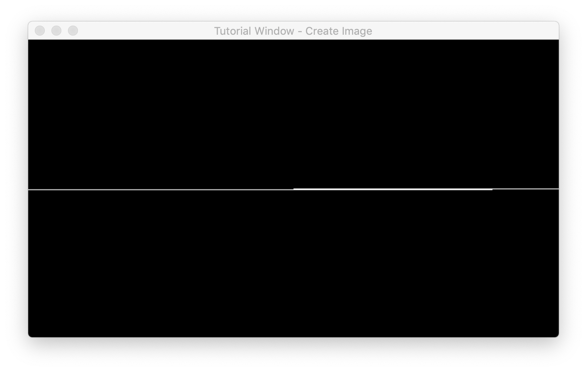

### How to create an image in MLX?
Setting up an image "buffer" is similar to setting up MLX and window. First, you need to allocate memory for the image with `mlx_new_image`.
```
#include "mlx.h"

int main()
{
    void *mlx = mlx_init();
    void *win = mlx_new_window(mlx, 640, 360, "Tutorial Window - Create Image");

    void *image = mlx_new_image(mlx, 640, 360);

    mlx_loop(mlx);
}
```

Make sure you don't lose the pointer given by `mlx_new_image`. You're going to need it again to display the image.

But for now, you should use `mlx_get_data_addr` to get information related to the image. This function needs 3 pointers to `int` variables to which it will assign new values. The function will also return a `char *` which points to the beginning of the memory address for the actual pixel data. (Refer to the [mlx_new_image manual](mlx_new_image.md))
```
int pixel_bits;
int line_bytes;
int endian;
char *buffer = mlx_get_data_addr(image, &pixel_bits, &line_bytes, &endian);
```

### How to draw pixels into the image?

The pixel data is initialized to `0`, meaning every pixel will be black without alpha.

The pixel data is a single array of `width * height * 4` bytes. For a 500x500 image, we would need 1'000'000 bytes or about 0.953 MB.

The way I like to iterate this array when `pixel_bits == 32` is:
- `y` is the Y coordinate in the **window**.
  - `y == 0` is the first (top) pixel within the window.
  - `y * line_bytes` lets us move up/down in **pixel** coordinates.
- `x` is the X coordinate in the **window**.
  - `x == 0` is the first (left) pixel.
  - `x` lets us move left/right in **pixel** coordinates.
- Remember that **one pixel on screen** requires **4 bytes in memory**.
- Remember that `buffer` is a `char *`.
  - When you increment the pointer by one by **one**, you're moving forward **one byte** in memory, so the final offset should be multiplied by `4`.
- `(y * line_bytes) + (x * 4)` is the beginning of the data for that screen pixel.

From here, the "proper" way to draw the image according to the [manual](mlx_new_image.md) is to:
1. Check how many bits there are per pixel.
2. Convert your color with `mlx_get_color_value` if necessary.
3. Check whether the environment is little/big endian.
4. Write your color value byte-by-byte into the pixel array, according to endianness.

```
int color = 0xABCDEF;

if (pixel_bits != 32)
    color = mlx_get_color_value(mlx, color);

for(int y = 0; y < 360; ++y)
for(int x = 0; x < 640; ++x)
{
    int pixel = (y * line_bytes) + (x * 4);

    if (endian == 1)        // Most significant (Alpha) byte first
    {
        buffer[pixel + 0] = (color >> 24);
        buffer[pixel + 1] = (color >> 16) & 0xFF;
        buffer[pixel + 2] = (color >> 8) & 0xFF;
        buffer[pixel + 3] = (color) & 0xFF;
    }
    else if (endian == 0)   // Least significant (Blue) byte first
    {
        buffer[pixel + 0] = (color) & 0xFF;
        buffer[pixel + 1] = (color >> 8) & 0xFF;
        buffer[pixel + 2] = (color >> 16) & 0xFF;
        buffer[pixel + 3] = (color >> 24);
    }
}
```

Finally, you can call `mlx_put_image_to_window` when you're ready to display the image.
```
mlx_put_image_to_window(mlx, win, image, 0, 0);
```

### "I have no idea what I just read!"
You should read up on the underlying *binary format* for integers and *bitwise operators* in C. Here's a very brief summary of what happens above:

Our color integer is 0xABCDEF or light blue. Here it is in binary, separated by bytes (big endian):
```
    Alpha    Red      Green    Blue
0x  00       AB       CD       EF
bin 00000000 10101011 11001101 11101111
```

Here's what happens when assigning green like so: `byte = (color >> 8) & 0xFF;`

`>>` is the "right shift" operator. It moves bytes to the right by the specified amount. Bits that are moved past the end of the bitfield are discarded while "new" bits on the left are padded with 0s.
```
color >> 8
             Alpha    Red      Green
0x  00       00       AB       CD
bin 00000000 00000000 10101011 11001101
```

`&` is the "bitwise AND" operator. It compares two bitfields and returns a bitfield where `1` is placed where **both** bitfields had `1`. Otherwise `0`.
```
color        Alpha    Red      Green
0x  00       00       AB       CD
bin 00000000 00000000 10101011 11001101

AND
0x 00       00       00       FF
bin 00000000 00000000 00000000 11111111

result
0x  00       00       00       CD
=   00000000 00000000 00000000 11001101
```

```byte = 0xCD```

### There is hope
However, there's a little shortcut you can use as long as `pixel_bits == 32`.
1. Check how many bits there are per pixel. (Optional if you know your supported platforms.)
2. Skip endian check, it should* be handled implicitly.
3. Skip `mlx_get_color_value` since ARGB color uses 32 bits.
4. Write your complete color value as an integer.

```
int *buffer = mlx_get_data_addr(image, &pixel_bits, &line_bytes, &endian);

int color = 0xABCDEF;

for(int y = 0; y < 360; ++y)
for(int x = 0; x < 640; ++x)
{
    buffer[(y * line_bytes) + x] = color;
}
```
The biggest difference here is that the address from mlx_get_data_addr is typecast to an `int *` instead. When you increment it by one, you're moving forward **4 bytes** in memory. Also, because the pointer now points to 4 bytes, you can assign the entire color in one go.

\*: The endianness problem is avoided as long as the platform uses the ARGB color layout. There are a few, see [wiki](https://en.wikipedia.org/wiki/RGBA_color_model#Representation).

### Other important notes
- It's dangerous to write pixel data without making sure your index is inside of the pixel array. Make sure to limit your maximum index, otherwise you may cause artifacts or freeze the whole computer. (It has happened on many occasions at our school.)
- If you're working with positions relative to the window (like mouse position), make sure you check that the position is inside of the window.
    - Otherwise you might write to negative indexes (which isn't a valid memory location) which won't show up on the screen
    - Or you might wrap around the window. For example, in a `640,320` window, drawing a line from `320,180` to `1200,180` would cause the line go into the right side and continue from the left side, on the next row of pixels.
        
        - This is because the pixel data is a single-dimensional array. When X is greater than the width of the image, it will access the next line.
