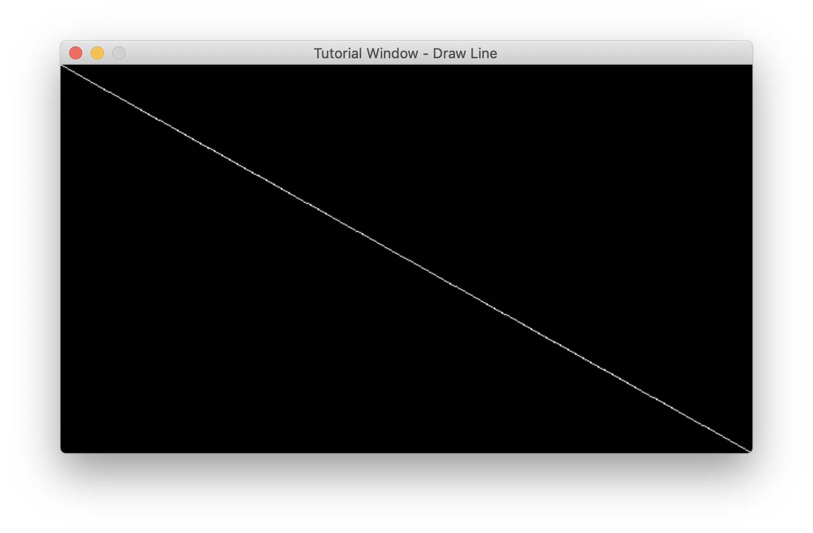

### How to draw a line on the screen with MLX?
Continuing from the previous [tutorial](mlx-tutorial-draw-pixel.md), this can get a bit more complicated.

First things first, let's define some properties of a line and what we need to draw it.
- We'll be using `mlx_pixel_put` for the sake of familiarity. Alternatively you could use [images](mlx_new_image.md).
  - We'll need `mlx` and `win`
- A line has `begin` and `end` points
- A line has color

So we could create a function something along the lines of:
```
int draw_line(void *mlx, void *win, int beginX, int beginY, int endX, int endY, int color);

draw_line(mlx, win, 10, 10, 20, 10); // This should create a horizontal line about 10 pixels long.
```
To get the direction of the line in 2D space, you can `end - begin`:
```
double deltaX = endX - beginX; // 10
double deltaY = endY - beginY; // 0
```

From this, we can approximate the number of pixels we'll have to draw along the way.
```
int pixels = sqrt((deltaX * deltaX) + (deltaY * deltaY));
//  pixels = sqrt((10 * 10) + (0 * 0)) = sqrt(100) = 10
```

The reason why we used `double` was so we can divide the total distance of our line by the amount of pixels we'll have to draw.
```
deltaX /= pixels; // 1
deltaY /= pixels; // 0
```

So we can finally start plotting the line with a very simple loop:
```
double pixelX = beginX;
double pixelY = beginY;
while (pixels)
{
    mlx_pixel_put(mlx, win, pixelX, pixelY, color);
    pixelX += deltaX;
    pixelY += deltaY;
    --pixels;
}
```

And if you did everything correctly, you should be able to draw a line from any point and any angle.
```
int main()
{
    void *mlx = mlx_init();
    void *win = mlx_new_window(mlx, 640, 360, "Tutorial Window - Draw Line");

    draw_line(mlx, win, 640, 360, 0, 0, 0xFFFFFF);

    mlx_loop(mlx);
}
```


