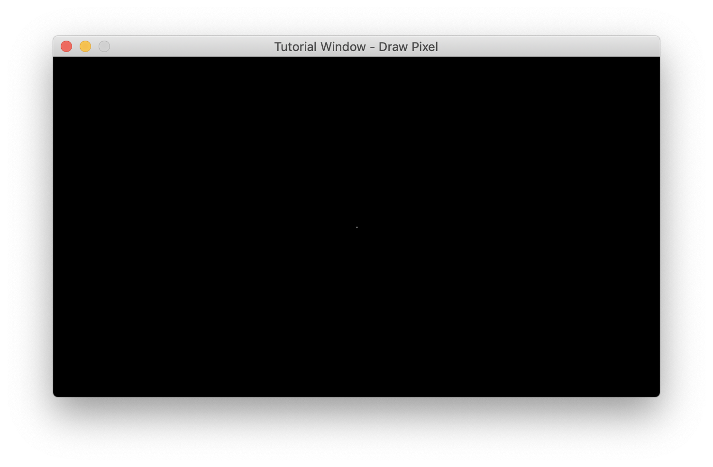

### How to draw a pixel on the window with MLX?
Continuing from the previous [tutorial](mlx-tutorial-create-window.md), drawing a single pixel is very straight-forward.
```
#include "mlx.h"

int main()
{
    void *mlx = mlx_init();
    void *win = mlx_new_window(mlx, 640, 360, "Tutorial Window - Draw Pixel");

    mlx_pixel_put(mlx, win, 640/2, 360/2, 0xFFFFFF);

    mlx_loop(mlx);
}
```

If you look closely, this will draw a white pixel at the very center of the window.



The main takeaway from this is how the color is determined by MLX. The [man page](mlx_pixel_put.md) explains that it takes 3 bytes to define a color with 16'777'216 shades.
```
0x  FF FF FF
Hex RR GG BB
```

To make any sense of colors in this format, you'll need to wrap your head around hexadecimal (base 16) numbers. Here's a [very good resource](https://www.mathsisfun.com/hexadecimal-decimal-colors.html) to get yourself started. [This](https://www.mathsisfun.com/binary-decimal-hexadecimal-converter.html) will also help you!

I would also strongly recommend creating yourself a function such as `rgb_to_int` so that you can easily create the colors you need.
```
int rgb_to_int(double r, double g, double b)
{
    int color = 0;
    color |= (int)(b * 255);
    color |= (int)(g * 255) << 8;
    color |= (int)(r * 255) << 16;
    return (color);
}
```
42 Students: Remember that **you must be able to explain your code during a defense**. Write your own function, or find out exactly how/why the above function works. And if you're reading this, make sure to question the people you are evaluating!
